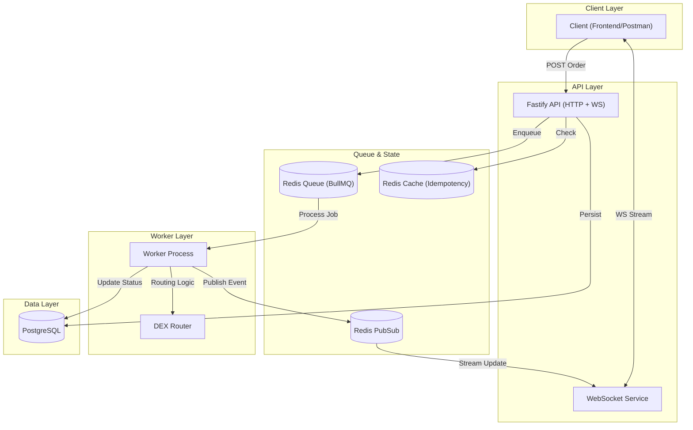

# Order Execution Engine (Backend Task 2)


A high-performance **Order Execution Engine** for the Solana blockchain, capable of routing orders to the best DEX (Raydium vs. Meteora), managing high concurrency via queues, and streaming real-time status updates via WebSockets.

---

## 📋 Table of Contents

- [Order Type Choice](#-order-type-choice)
- [Architecture](#-architecture)
- [Request Flow](#-request-flow)
- [Features](#-features)
- [Prerequisites](#-prerequisites)
- [Installation & Setup](#-installation--setup)
- [API Documentation](#-api-documentation)
- [Testing](#-testing)
- [Project Structure](#-project-structure)
- [Deliverables Checklist](#-deliverables-checklist)

---

## 🎯 Order Type Choice

**Selected Type: Market Order**

> **Why Market Order?**
> We chose **Market Orders** for this V1 implementation because they represent the core atomic unit of any trading system: "I want to buy X amount of token Y _now_ at the best available price."
>
> Implementing Market Orders first allows us to focus on the critical **routing latency** and **execution reliability** without the complexity of state management required for Limit orders (watching prices over time) or Sniper orders (watching mempool/blocks).

**Extensibility:**
This engine is designed to support **Limit** and **Sniper** orders with minimal changes:
- **Limit Orders:** Add a `targetPrice` field to the `orders` table. Instead of immediate queuing, add a `PriceWatcherService` that polls prices and only enqueues the job when `currentPrice <= targetPrice`.
- **Sniper Orders:** Add a `launchTime` or `contractAddress` trigger. The worker would subscribe to block events and trigger the swap execution in the same block as the liquidity add.

---

## 🏗 Architecture

The system uses a **Hybrid HTTP/WebSocket** pattern with an **Asynchronous Worker**.



---

## 🔄 Request Flow

1.  **Submission:** Client `POST`s an order to `/api/orders/execute`.
2.  **Validation:** API validates payload (Zod) and checks `Idempotency-Key` (Redis).
3.  **Queuing:** Order is saved to DB (`pending`) and pushed to BullMQ.
4.  **Connection:** Client connects to WebSocket `ws://.../execute?orderId=...`.
5.  **Processing:** Worker dequeues job:
    *   **Routing:** Fetches quotes from Mock Raydium & Meteora.
    *   **Decision:** Selects best price (net of fees).
    *   **Execution:** Simulates swap (2-3s delay) and confirms TX.
6.  **Streaming:** Worker publishes events (`ROUTING` -> `BUILDING` -> `CONFIRMED`) via Redis PubSub, which the API streams to the client.

---

## 🚀 Features

*   **Smart DEX Routing:** Compares quotes from multiple providers to ensure best execution.
*   **High Concurrency:** Handles spikes via Redis-backed BullMQ (configured for 10 concurrent jobs).
*   **Real-time Observability:** WebSocket updates for every step of the order lifecycle.
*   **Resilience:**
    *   **Idempotency:** Prevents duplicate orders using hash-based keys.
    *   **Rate Limiting:** Sliding window limiter (30 req/min/IP).
    *   **Backpressure:** Rejects requests (503) when queue depth exceeds threshold.
    *   **Retries:** Exponential backoff (2s, 4s, 8s) for failed jobs.
*   **Mock DEX Implementation:** Realistic simulation of network delays and price variance (-3% to +3%).

---

## 🛠 Prerequisites

*   **Node.js**: v18 or higher
*   **Docker & Docker Compose**: For local infrastructure (Redis, Postgres)

---

## 📦 Installation & Setup

1.  **Clone the repository**
    ```bash
    git clone https://github.com/yourusername/eterna_backend.git
    cd eterna_backend
    ```

2.  **Setup Environment**
    ```bash
    cp .env.example .env
    # The default .env is configured for local Docker usage
    ```

3.  **Start Infrastructure**
    ```bash
    docker-compose up -d redis postgres
    ```

4.  **Install Dependencies**
    ```bash
    npm install
    ```

5.  **Run Development Mode**
    You need two terminals:
    ```bash
    # Terminal 1: API Server
    npm run dev
    
    # Terminal 2: Worker Process
    npm run dev:worker
    ```

### 🐳 Running via Docker

To run the full stack (API + Worker + DB + Redis) in production mode:

```bash
docker-compose up --build
```

---

## 📚 API Documentation

### 1. Execute Order (HTTP)

**Endpoint:** `POST /api/orders/execute`

**Headers:**
*   `Idempotency-Key` (Optional): Unique string (e.g., UUID)

**Request Body:**
```json
{
  "type": "market",
  "tokenIn": "SOL",
  "tokenOut": "USDC",
  "amount": "1.5",
  "slippage": "0.01"
}
```

**Response (200 OK):**
```json
{
  "success": true,
  "orderId": "550e8400-e29b-41d4-a716-446655440000"
}
```

### 2. Live Status (WebSocket)

**URL:** `ws://localhost:3000/api/orders/execute?orderId={orderId}`

**Message Types:**

*   **Backfill:** Sent immediately on connection.
    ```json
    {
      "type": "backfill",
      "status": "pending",
      "logs": [...]
    }
    ```

*   **Status Update:** Streamed live.
    ```json
    {
      "type": "status_update",
      "status": "confirmed",
      "txHash": "mock-tx-hash-123",
      "executedPrice": "145.20",
      "dex": "raydium"
    }
    ```

---

## 🧪 Testing

The project uses **Vitest** for fast, reliable testing.

```bash
# Run all tests
npm test

# Run only unit tests (MockDexRouter, OrderService)
npm run test:unit

# Run integration tests (API endpoints)
npm run test:integration
```

---

## 📂 Project Structure

```
src/
├── app.ts                  # API Entry point
├── worker.ts               # Worker Entry point
├── config/                 # Environment & Connections
├── controllers/            # Request Handlers
├── services/               # Business Logic (OrderService, WebSocketService)
├── routes/                 # Route Definitions
├── lib/
│   ├── dex/                # Mock DEX Router & Simulators
│   └── queue/              # BullMQ Producer/Consumer
├── models/                 # DB Data Access Layer
└── middleware/             # Idempotency, Rate Limit, Backpressure
```

---

## ✅ Deliverables Checklist

- [x] **API with Routing:** Implemented in `OrderService` + `MockDexRouter`.
- [x] **WebSocket Updates:** Implemented in `WebSocketService` + Redis PubSub.
- [x] **Queue Management:** BullMQ with concurrency limit of 10.
- [x] **Documentation:** This README covers design decisions and flows.
- [x] **Testing:** >10 Unit/Integration tests included.
- [x] **Postman Collection:** Included in `docs/postman_collection.json`.

---
**License**: ISC