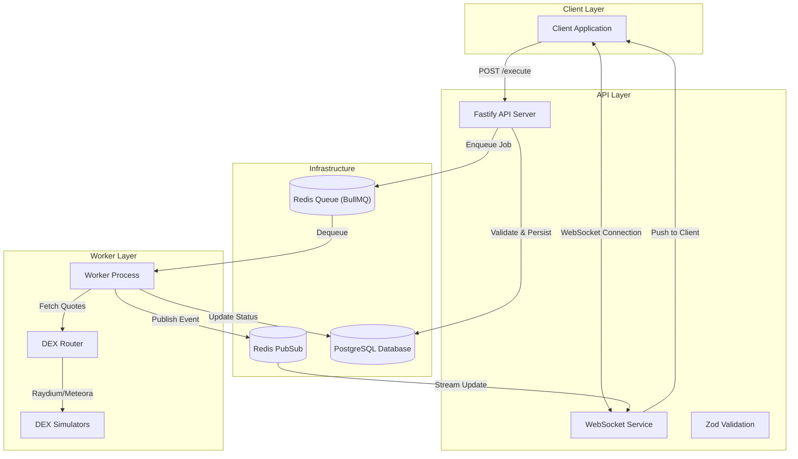

# Order Execution Engine

A high-performance, asynchronous order execution engine designed for the Solana blockchain. This system routes orders to the optimal Decentralized Exchange (DEX) by comparing real-time quotes from Raydium and Meteora, handling high concurrency through a reliable queue system, and providing real-time status updates via WebSockets.

## 🚀 Live Deployment

**Production URL**: [https://order-engine-production-4040.up.railway.app](https://order-engine-production-4040.up.railway.app)

**API Documentation**:

- [Postman Collection](./postman_collection.json) - Import this into Postman for instant API testing
- [WebSocket Streaming Guide](./docs/WEBSOCKET_GUIDE.md) - Complete guide for real-time order updates

### Quick Start

**Test the API immediately:**

```bash
# Submit a market order
curl -X POST https://order-engine-production-4040.up.railway.app/api/orders/execute \
  -H "Content-Type: application/json" \
  -d '{
    "type": "market",
    "tokenIn": "SOL",
    "tokenOut": "USDC",
    "amount": "1.5",
    "slippage": "0.01"
  }'
```

**Or use Postman:**

1. Download [postman_collection.json](./postman_collection.json)
2. Import into Postman (File → Import)
3. Run "Execute Market Order (SOL → USDC)" request
4. Create a WebSocket request with URL: `wss://order-engine-production-4040.up.railway.app/api/orders/execute?orderId={{orderId}}`
5. Watch real-time status updates!

## Table of Contents

1. [Architectural Overview](#architectural-overview)
2. [Design Decisions](#design-decisions)
3. [Order Type Selection](#order-type-selection)
4. [Request Lifecycle](#request-lifecycle)
5. [Prerequisites](#prerequisites)
6. [Installation and Setup](#installation-and-setup)
7. [API Reference](#api-reference)
8. [Testing Strategy](#testing-strategy)
9. [Project Structure](#project-structure)

---

## Architectural Overview

The system utilizes a **Hybrid HTTP/WebSocket architecture** decoupled by an asynchronous worker pattern. This ensures that the public API remains responsive under heavy load while complex routing and blockchain execution logic is handled in the background.

### System Diagram



### Key Components

- **API Service**: A lightweight Fastify server that accepts orders, performs validation, checks for idempotency, and manages WebSocket connections.
- **Worker Service**: A dedicated background process that consumes jobs from the queue. It is responsible for the CPU-intensive tasks of routing, price comparison, and transaction simulation.
- **Redis**: Acts as the backbone for both the job queue (BullMQ) and the real-time event bus (PubSub).
- **PostgreSQL**: Provides persistent storage for order history and audit logs.

---

## Project Structure

```text
eterna_backend/
├── src/
│   ├── app.ts                   # API Application Entry Point
│   ├── worker.ts                # Worker Process Entry Point
│   ├── config/                  # Configuration & Environment Validation
│   │   ├── index.ts             # Centralized config exports
│   │   ├── postgres.ts          # PostgreSQL connection setup
│   │   └── redis.ts             # Redis client configuration
│   ├── controllers/             # HTTP Request Handlers
│   │   ├── orderController.ts   # Order execution endpoint logic
│   │   └── metricsController.ts # Metrics & monitoring endpoints
│   ├── db/                      # Database Management
│   │   ├── migrations/          # SQL migration files
│   │   └── seed.ts              # Database seeding scripts
│   ├── lib/                     # Core Libraries
│   │   ├── dex/                 # DEX Integration Layer
│   │   │   ├── mockDexRouter.ts # Mock DEX price comparison
│   │   │   ├── raydiumSimulator.ts
│   │   │   └── meteoraSimulator.ts
│   │   └── queue/               # Job Queue Management
│   │       ├── producer.ts      # BullMQ job producer
│   │       ├── consumer.ts      # BullMQ job consumer/worker
│   │       └── index.ts
│   ├── middleware/              # Express/Fastify Middleware
│   │   ├── backpressure.ts      # Queue overload protection
│   │   ├── errorHandler.ts      # Global error handling
│   │   ├── idempotency.ts       # Duplicate request prevention
│   │   └── rateLimit.ts         # Rate limiting logic
│   ├── models/                  # Database Access Layer
│   │   └── order.ts             # Order CRUD operations
│   ├── routes/                  # API Route Definitions
│   │   ├── index.ts             # Route aggregator
│   │   ├── orderRoutes.ts       # Order-related routes
│   │   └── metricsRoutes.ts     # Metrics routes
│   ├── schemas/                 # Validation Schemas
│   │   ├── orderSchema.ts       # Zod schemas for orders
│   │   └── index.ts
│   ├── services/                # Business Logic Layer
│   │   ├── index.ts             # Service exports
│   │   ├── orderService.ts      # Order processing logic
│   │   ├── websocketService.ts  # WebSocket connection management
│   │   └── metricsService.ts    # Application metrics tracking
│   ├── types/                   # TypeScript Type Definitions
│   │   └── index.ts             # Shared types & interfaces
│   └── utils/                   # Utility Functions
│       └── logger.ts            # Structured logging (pino)
├── tests/
│   ├── integration/             # API Integration Tests
│   │   ├── orderExecution.test.ts
│   │   └── websocket.test.ts
│   └── unit/                    # Unit Tests
│       ├── orderService.test.ts
│       ├── mockDexRouter.test.ts
│       └── idempotency.test.ts
├── docs/
│   ├── Backend Task 2_ Order Execution Engine.md
│   └── WEBSOCKET_GUIDE.md       # WebSocket streaming documentation
├── scripts/                     # Utility Scripts
│   └── seed-db.ts               # Database seeding script
├── .env.example                 # Environment variables template
├── docker-compose.yml           # Docker services configuration
├── Dockerfile                   # Container build instructions
├── package.json                 # Dependencies & scripts
├── tsconfig.json                # TypeScript configuration
├── vitest.config.ts             # Vitest test configuration
├── postman_collection.json      # Postman API collection
├── POSTMAN_README.md            # Postman usage guide
└── README.md                    # This file
```

### Key Directories Explained

- **`src/config/`**: Centralized configuration with validation for all environment variables
- **`src/lib/dex/`**: Mock DEX simulators that mimic Raydium/Meteora quote APIs with realistic delays
- **`src/lib/queue/`**: BullMQ integration for asynchronous order processing with retry logic
- **`src/middleware/`**: Cross-cutting concerns like idempotency, rate limiting, and backpressure
- **`src/services/`**: Core business logic isolated from HTTP concerns for easier testing
- **`tests/`**: Comprehensive test suite with unit and integration tests (>10 tests total)

---

## Design Decisions

### 1. Fastify over Express

We selected Fastify for its low overhead and built-in support for asynchronous request handling. Its plugin architecture allowed for clean integration of WebSocket support (`@fastify/websocket`) and shared schema validation.

### 2. BullMQ for Job Management

Blockchain transactions are inherently asynchronous and prone to network latency. Using an in-memory approach would risk data loss during server restarts. BullMQ provides:

- **Persistence**: Jobs are stored in Redis, surviving process crashes.
- **Concurrency Control**: We strictly limit concurrent executions to 10 to prevent rate-limiting from RPC nodes.
- **Exponential Backoff**: Automatic retries (2s, 4s, 8s) for transient network failures.

### 3. Redis PubSub for Real-Time Updates

Polling the database for order status is inefficient. We implemented a PubSub pattern where the Worker publishes events to a specific channel (`order:status:{id}`). The API subscribes to this channel only when a client connects via WebSocket, ensuring efficient resource usage.

### 4. Idempotency Keys

To prevent double-spending or duplicate orders caused by network retries, every order request is hashed. If a request with the same `Idempotency-Key` and payload hash is received within 5 minutes, the system returns the existing order status instead of creating a new one.

---

## Order Type Selection

**Selected Type: Market Order**

For this V1 implementation, we prioritized **Market Orders**.

**Justification:**
Market orders represent the fundamental atomic unit of a trading engine—immediate execution at the best available price. Implementing this first allows us to focus on the critical challenges of **routing latency** and **execution reliability** without the added complexity of state management required for Limit orders (watching price feeds over time).

**Extensibility:**
The architecture allows for seamless addition of other types:

- **Limit Orders**: Would involve a new "Price Watcher" service that polls price feeds and only enqueues the job into BullMQ when the target price is triggered.
- **Sniper Orders**: Would involve listening to mempool or block events to trigger execution in the same block as a liquidity provision event.

---

## Request Lifecycle

1.  **Submission**: The client sends a `POST` request with the token pair and amount.
2.  **Validation**: The API validates the payload and checks the idempotency cache.
3.  **Queuing**: The order is created in PostgreSQL with a `PENDING` status and added to the Redis queue.
4.  **Connection**: The client connects to the WebSocket endpoint to listen for updates.
5.  **Routing**: The Worker picks up the job, queries the Mock DEX Router for quotes from Raydium and Meteora, and selects the best provider based on net output (after fees).
6.  **Execution**: The Worker simulates the transaction, waits for confirmation, and updates the database.
7.  **Notification**: Every state change (`ROUTING` -> `BUILDING` -> `CONFIRMED`) is published to Redis and streamed instantly to the client.

---

## Prerequisites

- **Node.js**: v18 LTS or higher
- **Docker & Docker Compose**: Required for running the local infrastructure stack.

---

## Installation and Setup

### 1. Repository Setup

```bash
git clone https://github.com/yourusername/eterna_backend.git
cd eterna_backend
```

### 2. Environment Configuration

Copy the example environment file. The defaults are pre-configured for the Docker environment.

```bash
cp .env.example .env
```

### 3. Start Infrastructure

Start the Redis and PostgreSQL containers:

```bash
docker-compose up -d redis postgres
```

### 4. Install Dependencies

```bash
npm install
```

### 5. Run Application

For development, run the API and Worker in separate terminal windows:

```bash
# Terminal 1: API Server
npm run dev

# Terminal 2: Worker Process
npm run dev:worker
```

Alternatively, run the entire stack using Docker:

```bash
docker-compose up --build
```

---

## API Reference

### Execute Order

**Endpoint**: `POST /api/orders/execute`

Submits a new order for execution.

**Headers**:

- `Content-Type`: `application/json`
- `Idempotency-Key` (Optional): Unique string (UUID recommended)

**Request Body**:

```json
{
  "type": "market",
  "tokenIn": "SOL",
  "tokenOut": "USDC",
  "amount": "1.5",
  "slippage": "0.01"
}
```

**Response**:

```json
{
  "success": true,
  "orderId": "550e8400-e29b-41d4-a716-446655440000"
}
```

### WebSocket Stream

**URL**: `ws://localhost:3000/api/orders/execute?orderId={orderId}`

Connect to this endpoint to receive real-time updates for a specific order.

**Message Format (Backfill)**:
Sent immediately upon connection, containing the current status and log history.

```json
{
  "type": "backfill",
  "status": "pending",
  "logs": [...]
}
```

**Message Format (Status Update)**:
Streamed whenever the order status changes.

```json
{
  "type": "status_update",
  "status": "confirmed",
  "txHash": "mock-tx-hash-123",
  "executedPrice": "145.20",
  "dex": "raydium"
}
```

---

## Testing Strategy

The project utilizes **Vitest** for a fast and unified testing experience.

- **Unit Tests**: Located in `tests/unit/`. These mock all external dependencies (DB, Redis) to verify business logic, routing calculations, and slippage protection.
- **Integration Tests**: Located in `tests/integration/`. These spin up the API instance and verify the HTTP endpoints and validation logic.

**Run all tests**:

```bash
npm test
```

---
